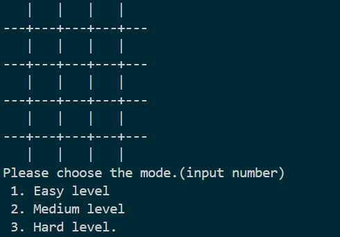
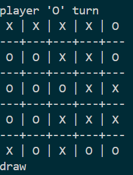

# Tic tac toe-Minimax algorithm(Python application)

### Overview:
This is a Python‑based Tic‑Tac‑Toe game where the player competes against the computer with **three difficulty levels**.

**Easy:** the computer places pieces randomly.

**Medium:** the computer blocks the player from winning and tries to win when possible.

**Hard:** the computer is unbeatable – it will always win or force a draw, no matter how the player moves.

---

### Features:
The project is structured into several functions, each handling a specific part of the game logic.

1. **Board creation and display:**
    Creates a 2D list to represent the board and prints it with grid lines so it looks like a proper game board.

2. **Game outcome detection:**
    Uses two functions to evaluate the board:
    - One function prints the result for the player.
    - Another function returns a score for the AI.

    The win condition is:
    - If the board size is smaller than 6×6, the number of connected pieces required equals the board size.
    - For larger boards, players must connect 5 in a row to win.

3. **AI decision logic (three difficulty levels):**
    -`ai_play_easy`: places a piece randomly using random module.
    -`ai_play_mid`: blocks the player from winning and tries to win if possible; otherwise, it falls back to a random move.
    -`ai_play_hard`: uses the Minimax algorithm to choose the best move so the AI will never lose.

4. **Minimax with alpha‑beta pruning :** 
    The Minimax function calls itself recursively to:
    - Explore possible moves for both the player and the AI.
    - Find moves that would cause the AI to lose and avoid them.
    - Choose the best move for the AI to win or force a draw.

    To improve performance, alpha‑beta pruning is implemented.
    The algorithm also tracks the depth (number of steps) to win, and this depth influences the returned score.

5. **Game loop and difficulty control:**
    The main play function:
    - Handles the game loop.
    - Lets the user choose the difficulty level.
    
    For performance reasons, the Hard AI starts as the Medium AI, and only switches to full Minimax when there are 9 or fewer empty spaces left on the board.

### Demo/Screenshots:


*initiate board and level selection interface*

 
*Game with draw result interface*

---

### How to run:
1. platform able to run Python 

2. Install required modules:
```bash 
   pip install -r requirements.txt
   ```

3. run the program using:
   
```bash 
   python v5_minimax.py
   ```
---

### Project Structure:
```
.
├── final_version/
|   └── v5_minimax.py
├──version/
|    ├── v1_two_players.py
|    ├── v2_random_ai.py
|    ├── v3_blocking_ai.py
|    └── v4_minimax_raw.py
└─── assets/
     ├── initiate board and level selection.png
     └── game with draw result.png

```
---

### What I Learned:
- Basic concept of recursion
- Basic minimax algorithm
- Basic Alpha beta pruning 
- Structuring AI logic into multiple difficulty levels

---

### Future Improvements:
- **Implement UI/UX interface:** Turn the program into a graphical application to make it more user‑friendly.
- **Control recursion depth dynamically:** Instead of starting with the medium AI and switching to hard later, explore using depth limits so the hard AI can be used from the beginning while keeping performance acceptable.
- **Add more game:** Extend the application with similar board games that can reuse the algorithm, such as Gomoku, Connect 6, etc.
---


